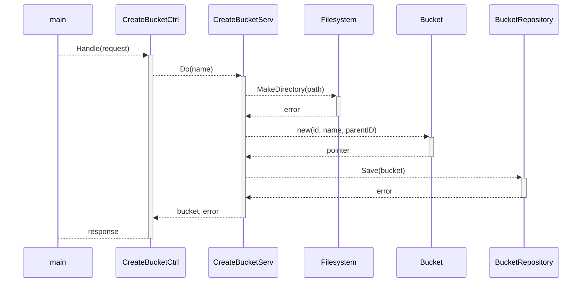

<h3 align="center">
  <br/>
</h3>

<p align="center"><i>Simplistic and minimalist storage.</i></p>

## Usage

Run the application on a terminal. You can customize the execution using the following flags:

```
  -f string
        storage folder name (alias) (default "storage")
  -folder string
        storage folder name (default "storage")
  -h string
        host (alias) (default "localhost")
  -help
        shows help
  -host string
        host (default "localhost")
  -p int
        port (alias) (default 80)
  -port int
        port (default 80)
```

## Features

| Feature                                 | Method | Endpoint (/api/v1)           |
|-----------------------------------------|--------|------------------------------|
| List Buckets                            | GET    | /buckets                     |
| Create a Bucket                         | POST   | /buckets                     |
| Upload an Object to a Bucket            | POST   | /buckets/{bucketID}/objects  |
| List Buckets in a first level of Bucket | GET    | /buckets/{bucketID}/buckets  |
| List Objects in a first level of Bucket | GET    | /buckets/{bucketID}/objects  |
| Download an Object                      | GET    | /objects/{objectID}/download |
| Delete an Object                        | DELETE | /objects/{objectID}          |
| Delete a Bucket                         | DELETE | /buckets/{bucketID}          |

## Repositories Implementations

Store the information about buckets and objects as a metadata to process some requests simple as possible.

| Implementation | Description                |
|----------------|----------------------------|
| In Memory      | Uses server's RAM          |
| File           | Uses a JSON representation |

## How it works?

**Gostore** save information into a local storage folder, keeping the structure with parents, but using uuids as a names.
Buckets are stored as folders, objects are stored as files.

When a request has started, the program give the control to the router, that send the request to some controller.
Then, a service handle the action, interact with the filesystem (if necessary), and then save or update the metadata about the buckets or objects.
This metadata helps the program to get information fast.

**Gostore** was made following hexagonal architecture with some principles of DDD.


