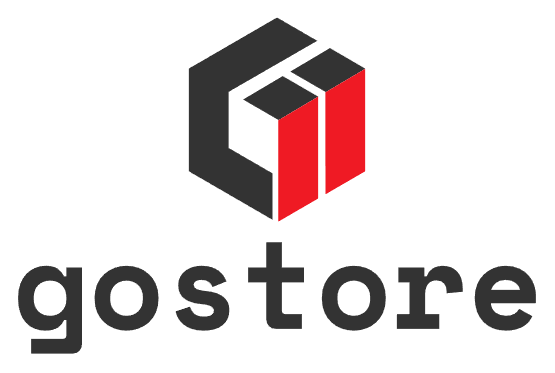

    Simplistic and minimalist storage.

## Features

**List Buckets:**
- Method: GET
- Route: `/buckets`

**Create Bucket:**
- Method: POST
- Route: `/buckets`

**Upload an Object to a Bucket:**
- Method: POST
- Route: `/buckets/{bucketID}/objects`

**Download an Object:**

- Method: GET
- Route: `/objects/{objectID}/download`
